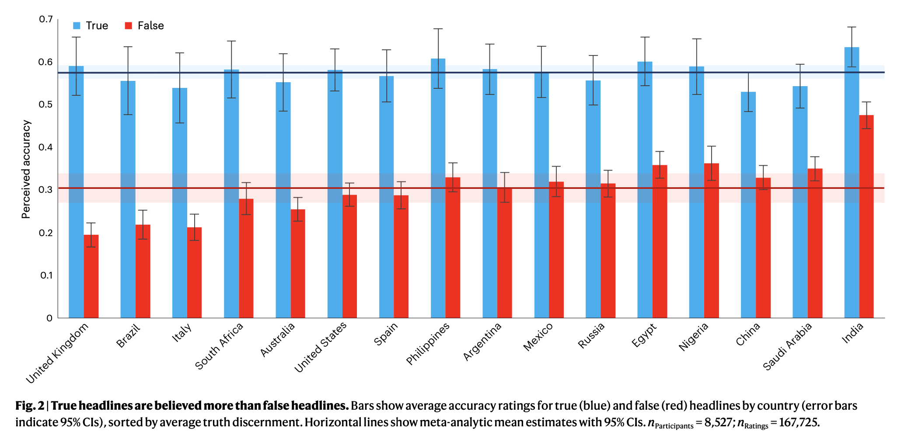
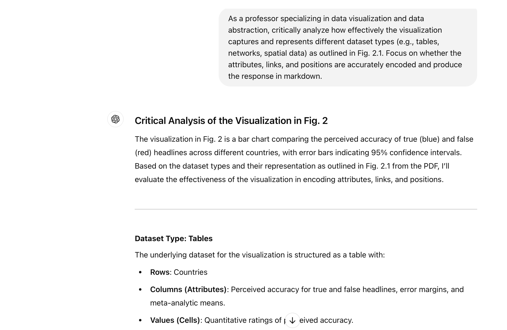
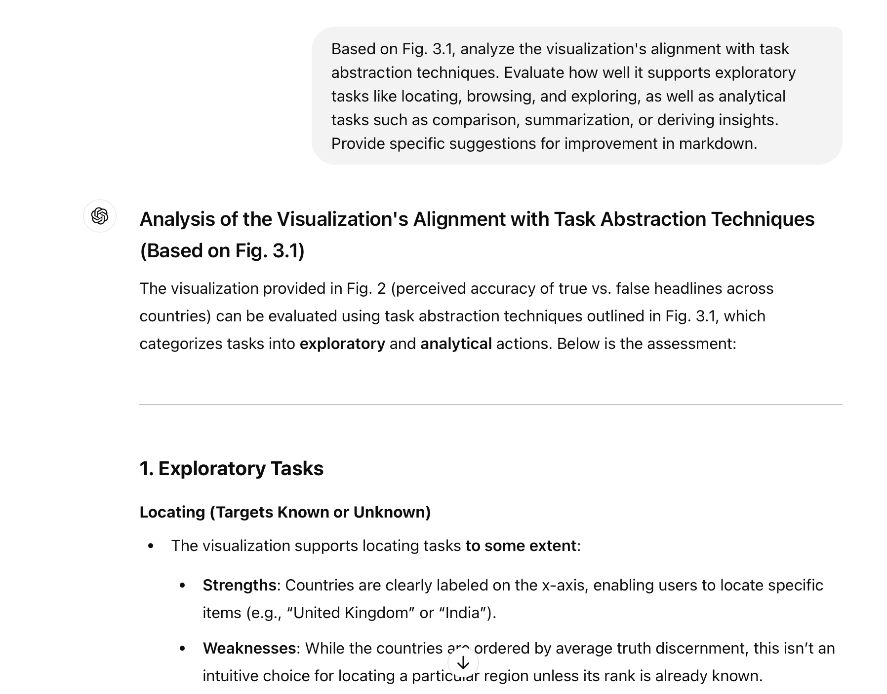
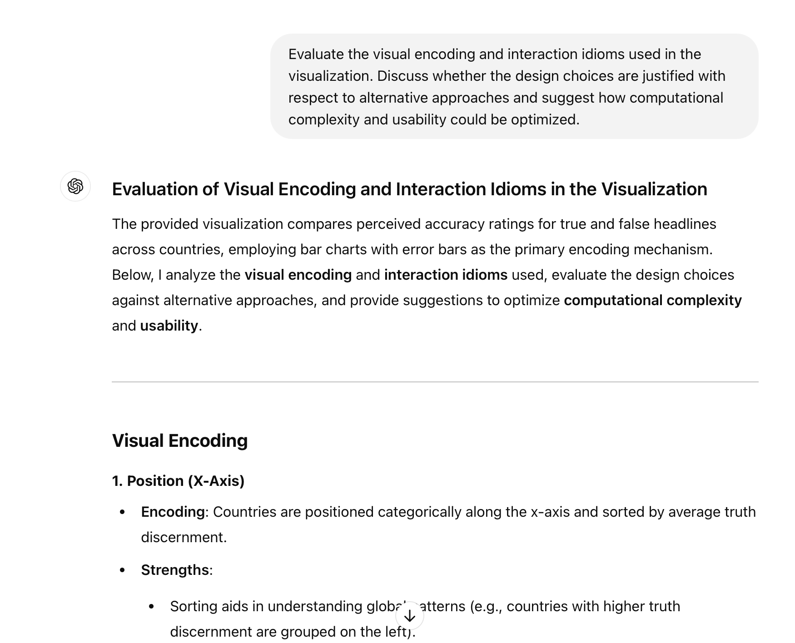
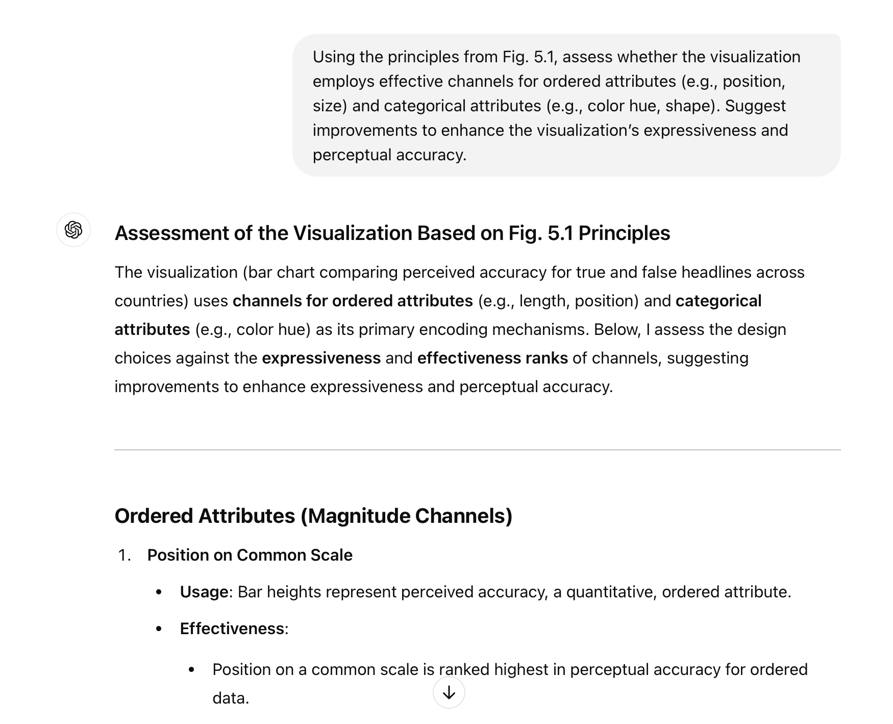
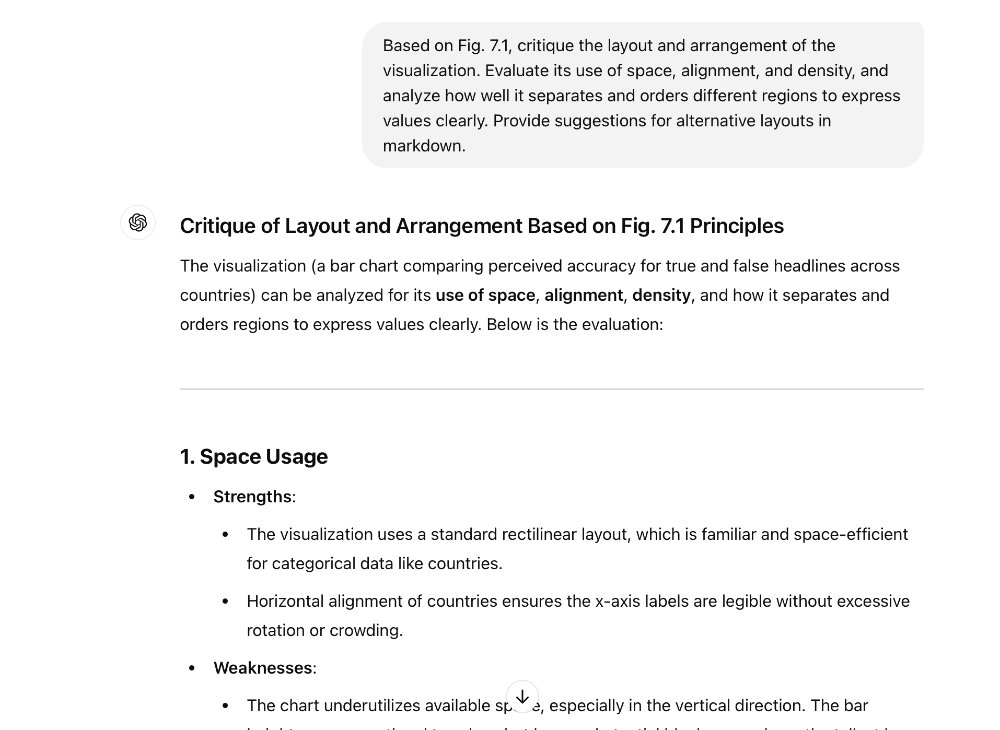
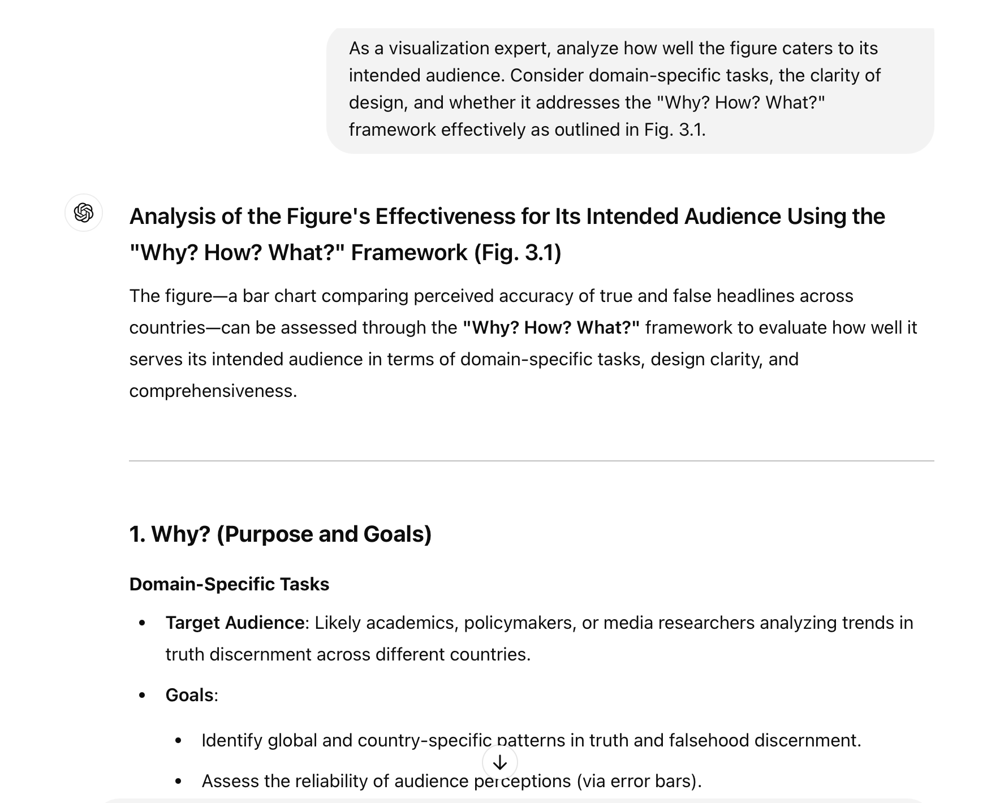
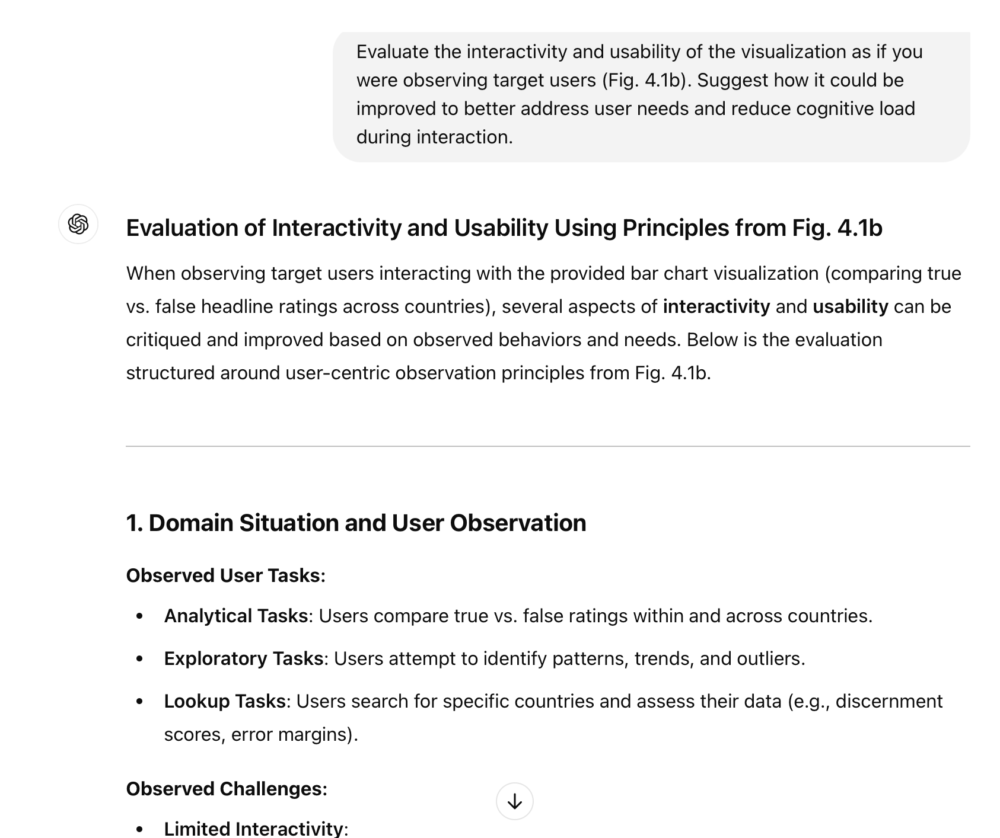
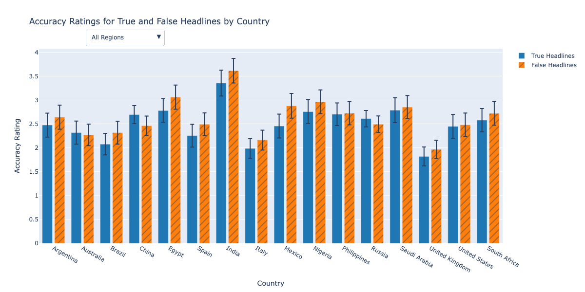
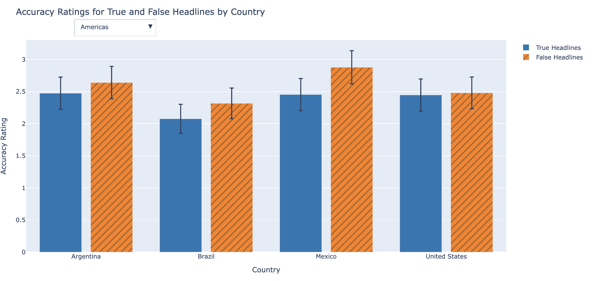

# Infovis Redesign Project Final Report

## I. Introduction

In the field of data visualization, effectively presenting complex research findings is critical for improving understanding and facilitating decision-making. I chose to analyze and redesign a figure in the academic article titled “Understanding and Combatting Misinformation Across 16 Countries on Six Continents” (Arechar et al., 2023), shown below as Figure 1. This figure is a visual representation of how participants across 16 countries rated the perceived accuracy of true and false news headlines during a study on misinformation.

The visualization is relevant in the context of global misinformation research, an academic field that combines psychology, sociology, and data analysis to understand the spread and belief in false information. Specifically, the figure highlights the distinction in perceived accuracy between true and false headlines in different countries, using bar charts with error margins to convey statistical reliability. This context is especially relevant given the increasing importance of combatting misinformation on social media platforms and its real-world implications, such as shaping public opinion or influencing behavior during crises like the COVID-19 pandemic.

My redesign project aims to improve the clarity and accessibility of this visualization for a broader audience using approaches learned in class while maintaining the same story. Through this project, I hope to explore how design choices can enhance data communication without compromising the storytelling of the content.

---

## II. LLM Evaluation

While redesigning Figure 1 from the paper, I consulted a Large Language Model (LLM) for a critical evaluation of the original visualization. The LLM provided feedback on several key aspects, including data representation, task abstraction, visual encoding, and usability. Below is a summary of the insights from this evaluation, organized by the prompts used during the interaction.

### Dataset and Encoding Evaluation (Prompt 1)

The LLM analyzed how well the visualization represents its underlying tabular dataset, structured with rows as countries and columns capturing perceived accuracy for true and false headlines, along with error margins and meta-analytic means. It highlighted the chart's effective use of attributes like color (blue for true, red for false) and position (countries ordered by truth discernment), which allow clear comparisons. However, it noted that the chart does not represent relationships between countries (e.g., regional patterns) or spatial/geometric attributes, suggesting alternative designs like network graphs or maps if such relationships were relevant. The LLM also recommended using diverging bar charts or patterns to emphasize differences between true and false ratings more effectively.

### Task Abstraction and Analytical Support (Prompt 2)

The LLM evaluated the visualization's alignment with exploratory and analytical tasks. It acknowledged the chart's support for high-level browsing and within-country comparisons, thanks to clear x-axis labels and side-by-side bars. However, it critiqued the chart's static nature for limiting deeper exploration, such as locating specific countries or uncovering regional trends. Suggested improvements included adding interactive sorting, filters, and search functionalities. Additionally, it proposed enhancements like clustering countries by regions or income levels to facilitate better group-based comparisons, as well as annotations to highlight significant outliers or trends.

### Visual Encoding and Design Choices (Prompt 3)

The LLM commended the use of bar height and error bars for representing ordered attributes and color hues for categorical differences. However, it critiqued the redundancy of solid colors and recommended alternatives like gradients or patterns to improve accessibility for color-blind users. For error bars, it suggested replacing them with shaded confidence intervals to reduce visual clutter and enhance clarity.

### Layout and Arrangement (Prompt 4)

The LLM analyzed the chart's layout and spatial arrangement, praising its use of horizontal alignment for clear comparisons and space-efficient labeling. However, it noted underutilized vertical space and tightly packed bars, particularly for countries with similar discernment scores. Recommendations included increasing bar height to utilize space more effectively, grouping countries by region with separators for context, and introducing dynamic scaling to emphasize differences where scores are close.

### Audience-Specific Considerations (Prompt 5)

Using the "Why? How? What?" framework, the LLM evaluated the visualization’s effectiveness for its audience—academics, policymakers, and media researchers. It highlighted the chart's ability to support basic comparisons and identify global patterns, such as the consistent higher ratings for true headlines. However, it noted gaps in exploratory functionality and suggested enhancements like annotations to highlight key insights, grouped charts for regional trends, and a summary of global patterns to make the chart more actionable.

### Usability and Interaction (Prompt 6)

The LLM emphasized the static nature of the chart as a limitation, particularly for tasks like exploring outliers or comparing subsets of countries. It recommended adding interactivity, such as hover-to-reveal tooltips, dynamic sorting by different metrics, and region-based filters to reduce cognitive load. It also proposed clustering countries by categories like regions or economic groups and incorporating diverging bar charts to simplify within-country comparisons.

### Replicability and Reproducibility (Prompt 7)

The LLM reflected on challenges in replicating the visualization using simulated data. Issues included a lack of access to the original dataset, aligning bar heights with error bars, and ensuring readability of x-axis labels for densely packed countries. Recommendations included providing the dataset or preprocessing steps alongside the visualization and using tools like Plotly for better interactivity and reproducibility.

---

## III. Critique and Redesign Proposal

### Critique of the Original Visualization

The original visualization effectively uses bar heights to encode quantitative data, leveraging position on a common scale, which Tamara Munzner highlights in Chapter 5 of *Visualization Analysis and Design* as one of the most accurate channels for representing magnitude. However, overlapping error bars lead to visual clutter, making it difficult to discern differences. Additionally, the reliance on color alone poses accessibility challenges for color-blind users.

### Redesign Proposal

To address these limitations, the redesigned visualization focuses on improving clarity, enhancing accessibility, and enabling exploratory analysis.

- **Clarity**: Adjusted x-axis labels, increased spacing, and grouped regions improve readability.
- **Accessibility**: Shaded confidence intervals and patterns for color-blind users enhance inclusivity.
- **Exploration**: Interactive features like region-based filtering and hover-over tooltips allow deeper analysis.

---

## IV. Implementation

The redesigned visualization builds on the original figure but focuses on improving clarity, accessibility, and interactivity without deviating from the authors' original design intent. Simplicity was prioritized to maintain the integrity of the data, following Munzner's Chapter 6 guidance that “simplicity isn’t always bad.”

### Redesigned Visualization

#### Figure 9a: Redesigned chart  

#### Figure 9b: Region filter in action  

Interactive features include region filtering, hover-over tooltips, and annotations, all of which address the limitations of the static original design.

---

## V. Reflection on LLM Use

Using LLMs like ChatGPT was invaluable for generating code and structuring feedback, but human judgment was essential for refining outputs and aligning them with the dataset. Key challenges included resolving coding issues and interpreting suggestions to suit the visualization's context. Despite these difficulties, the LLM guided the process effectively, highlighting areas for improvement and providing a foundation for the redesign.

---
## References

Arechar, A. A., Allen, J., Berinsky, A. J., Cole, R., Epstein, Z., Garimella, K., Gully, A., Lu, J. G., Ross, R. M., Stagnaro, M. N., Zhang, Y., Pennycook, G., & Rand, D. G. (2023). Understanding and combatting misinformation across 16 countries on six continents. *Nature Human Behaviour, 7*(9), 1502–1513. https://doi.org/10.1038/s41562-023-01641-6
